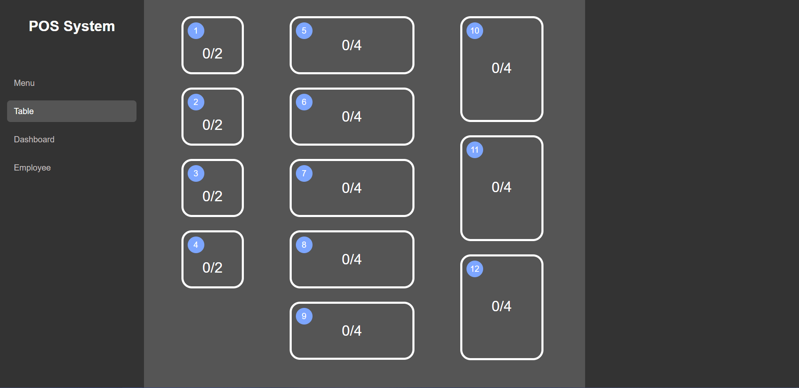
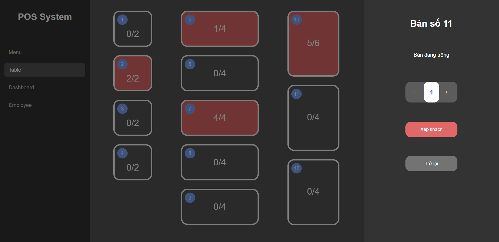

# POS System

NHH

<p align="center">
  <br>
  
  <br>
  <br>
  
  <br>
  <br>
  
  <br>
  <br>
  
  <br>
</p>

This project was bootstrapped with [Create React App](https://github.com/facebook/create-react-app).

## Getting Started

First, install [Node.js](https://nodejs.org/en/download/).

Open the project folder (recommeded using [Visual Studio Code](https://code.visualstudio.com/)), run following command to install all the necessary package:

```bash
npm install
```

Then, run the development server:

```bash
npm run dev
```

Open [http://localhost:3000](http://localhost:3000) to view it in your browser.

The page will reload when you make changes.\
You may also see any lint errors in the console.
